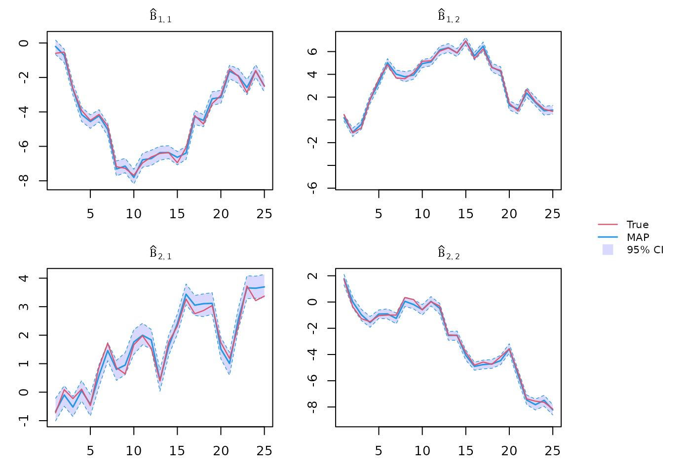
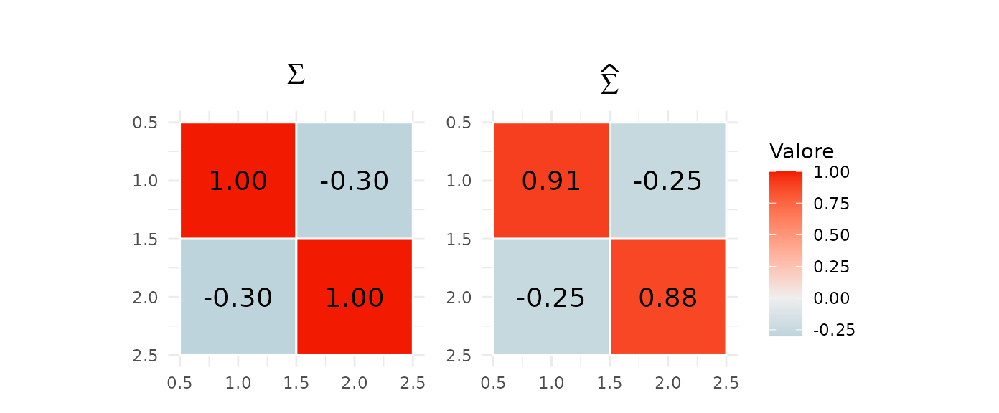
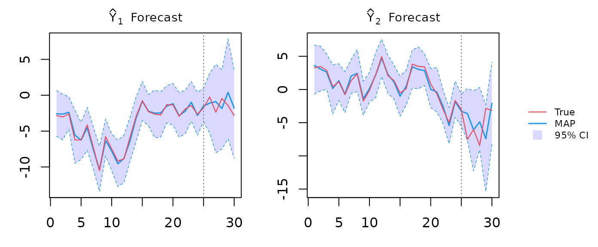
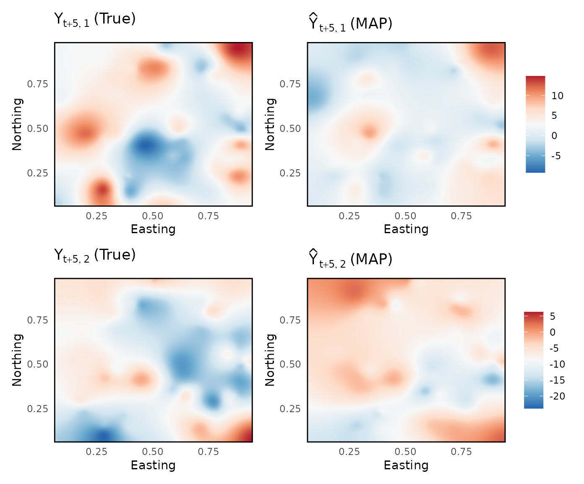

# Dynamic Bayesian Predictive Stacking for Spatiotemporal Analysis - Tutotial

We provide a brief tutorial of the `spFFBS` package. Here we shows the
implementation of the Dynamic Bayesian Predictive Stacking on
synthetically generated data. For any further details please refer to
(Presicce and Banerjee 2026). More examples, are available in
documentation, and functions help.

### Working packages

``` r
library(spFFBS)
library(spBPS)
```

### Data generation

We generate data from the model detailed in Equation (1) (Presicce and
Banerjee 2026), over a unit square.

``` r
# Dimensions
tmax <- 25
tnew <- 5
n    <- 150
q    <- 2
p    <- 2
u    <- 50

# Parameters
Sigma  <- matrix(c(1, -0.3, -0.3, 1), q, q)
phi <- 8
alfa <- 0.8
a <- ((1/alfa)-1)
V <- a*diag((n+u))

set.seed(1)
# Generate constant sinthetic data structure
coords <- matrix(runif((n+u) * 2), ncol = 2)
D <- spBPS:::arma_dist(coords)
K <- exp(-phi * D)
W <- rbind( cbind(diag(p), matrix(0, p, (n+u))), cbind(matrix(0, (n+u), p), K) )

# Prior information and initial state
m0     <- matrix(0, (n+u)+p, q)
C0 <- rbind( cbind(diag(0.005, p), matrix(0, p, (n+u))), cbind(matrix(0, (n+u), p), K) )
theta0 <- mniw::rMNorm(n = 1, Lambda = m0, SigmaR = C0, SigmaC = Sigma)

# Generate dynamic sinthetic data structure
G <- array(0, c((n+u)+p, (n+u)+p, tmax+tnew))
theta <- array(0, c((n+u)+p, q, tmax+tnew))
X <- array(0, c((n+u), p, tmax+tnew))
P <- array(0, c((n+u), (n+u)+p, tmax+tnew))
Y <- array(0, c((n+u), q, tmax+tnew))

set.seed(1)
for (t in 1:(tmax+tnew)) {
  if (t >= 2) {  
    
  G[,,t]     <- diag(p+n+u)
  theta[,,t] <- G[,,t] %*% theta[,,t-1] + mniw::rMNorm(n = 1, Lambda = m0, SigmaR = W, SigmaC = Sigma)
  X[,,t]     <- matrix(runif((n+u)*p), (n+u), p)
  P[,,t]     <- cbind(X[,,t], diag((n+u)))
  Y[,,t]     <- P[,,t] %*% theta[,,t] + mniw::rMNorm(n = 1, Lambda = matrix(0, (n+u), q), SigmaR = V, SigmaC = Sigma)
  } 
  else {
    
  G[,,t]     <- diag(p+n+u)
  theta[,,t] <- G[,,t] %*% theta0 + mniw::rMNorm(n = 1, Lambda = m0, SigmaR = W, SigmaC = Sigma)
  X[,,t]     <- matrix(runif((n+u)*p), (n+u), p)
  P[,,t]     <- cbind(X[,,t], diag((n+u)))
  Y[,,t]     <- P[,,t] %*% theta[,,t] + mniw::rMNorm(n = 1, Lambda = matrix(0, (n+u), q), SigmaR = V, SigmaC = Sigma)
  }
}

# Unobserved data
Yfuture <- Y[(1:n),,(tmax+1):(tmax+tnew)]
Ytilde <- Y[-(1:n),,]
thetatilde <- theta[-(1:(n+p)),,]
Xtilde <- X[-(1:n),,]
crdtilde <- coords[-(1:n),]
Dtilde   <- as.matrix(dist(crdtilde))
Ktilde   <- exp(-phi*Dtilde)

# Observed data
Y <- Y[(1:n),,1:tmax]
X <- X[(1:n),,]
P     <- P[(1:n),1:(n+p),]
G     <- G[1:(n+p), 1:(n+p),]
crd <- coords[1:n,]
D   <- as.matrix(dist(crd))
K   <- exp(-D)
W <- rbind( cbind(diag(p), matrix(0, p, n)), cbind(matrix(0, n, p), K) )
V <- a*diag((n))
```

### Setting priors and hyperparameters

``` r
# Priors
m0     <- matrix(0, n+p, q)
C0 <- rbind( cbind(diag(0.005, p), matrix(0, p, n)), cbind(matrix(0, n, p), K) )
nu0 <- 3
Psi0 <- diag(q)
prior <- list("m" = m0, "C" = C0, "nu" = nu0, "Psi" = Psi0)

# hyperparameters values
alfa_seq <- c(0.7, 0.8, 0.9)
phi_seq <- c(6, 8, 9)
par_grid <- list(tau = alfa_seq, phi = phi_seq)
```

### Dynamic BPS fit

Posterior inference, forecast and spatial interpolation call:

``` r
out <- spFFBS::spFFBS(Y = Y, G = G, P = P, D = D,
                      grid = par_grid, 
                      prior = prior,
                      L = 200,
                      do_BS = T, 
                      do_forecast = T, 
                      tnew = tnew,
                      do_spatial = T,
                      spatial = list(crd = crd,
                                     crdtilde = crdtilde,
                                     Xtilde = Xtilde,
                                     t = tmax+tnew))
```

### Beta posterior inference

``` r
theta_post <- sapply(1:tmax, function(t){ out$BS[[t]] }, simplify = "array")
beta_post <- theta_post[1:p, 1:q,,]
```



### Sigma posterior inference

``` r
# Global weights
Wglobal <- out$Wglobal
J <- nrow(Wglobal)

set.seed(1)
# Posterior sampling
L <- 200
indL <- sample(1:J, L, Wglobal, rep = T)
Sigma_post <- sapply(1:L, function(l) {
  mniw::riwish(1, nu = out$FF[[tmax]]$filtered_results[[indL[l]]]$nu,
               Psi = out$FF[[tmax]]$filtered_results[[indL[l]]]$Psi) },
  simplify = "array")
Sigma_map <- apply(Sigma_post, c(1,2), median)
```



### Multivariate outcome temporal forecasts

``` r
Y_forc <- out$forecast$Y_pred
```



### Unobserved spacetime-points interpolation

Spatial interpolation for unobserved locations at future time points,
here time point 30

``` r
Y_pred <- sapply(1:L, function(l){out$spatial[[1]][[l]][1:u,]}, simplify = "array")
```



------------------------------------------------------------------------

Presicce, Luca, and Sudipto Banerjee. 2026. “Adaptive Markovian
Spatiotemporal Transfer Learning in Multivariate Bayesian Modeling.”
*arXiv Preprint*, arXiv:2602.08544.
<https://doi.org/10.48550/arXiv.2602.08544>.
